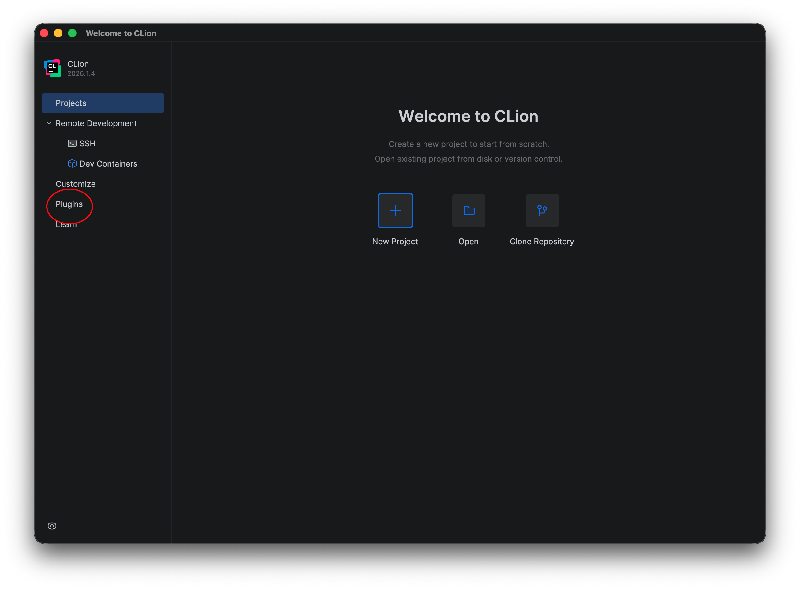
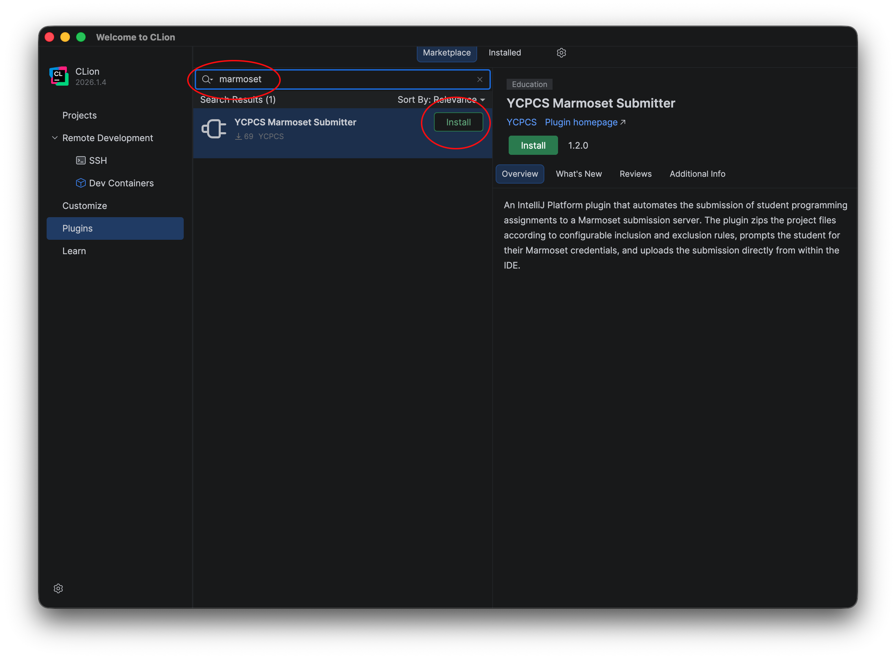
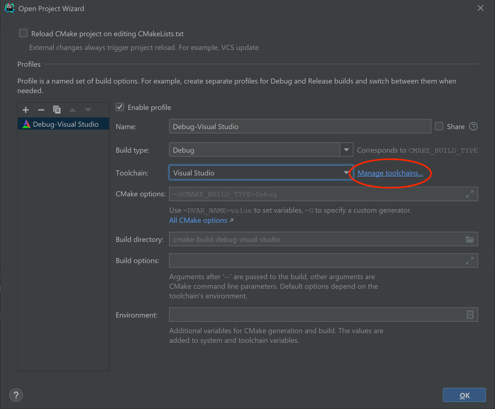
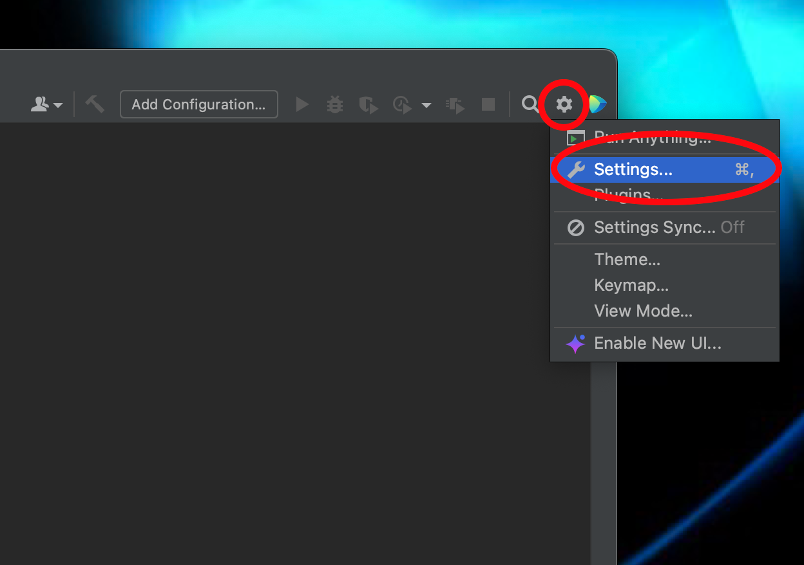
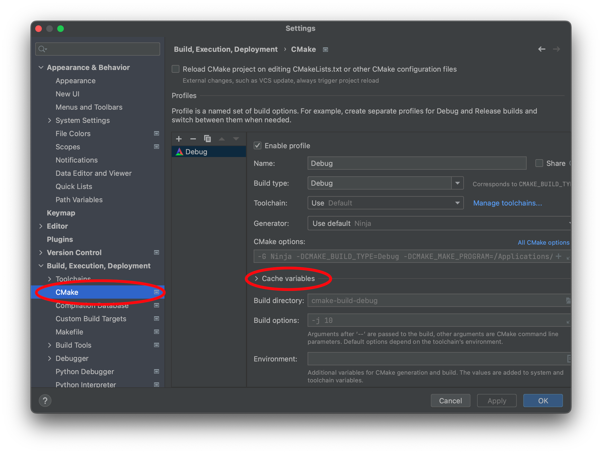
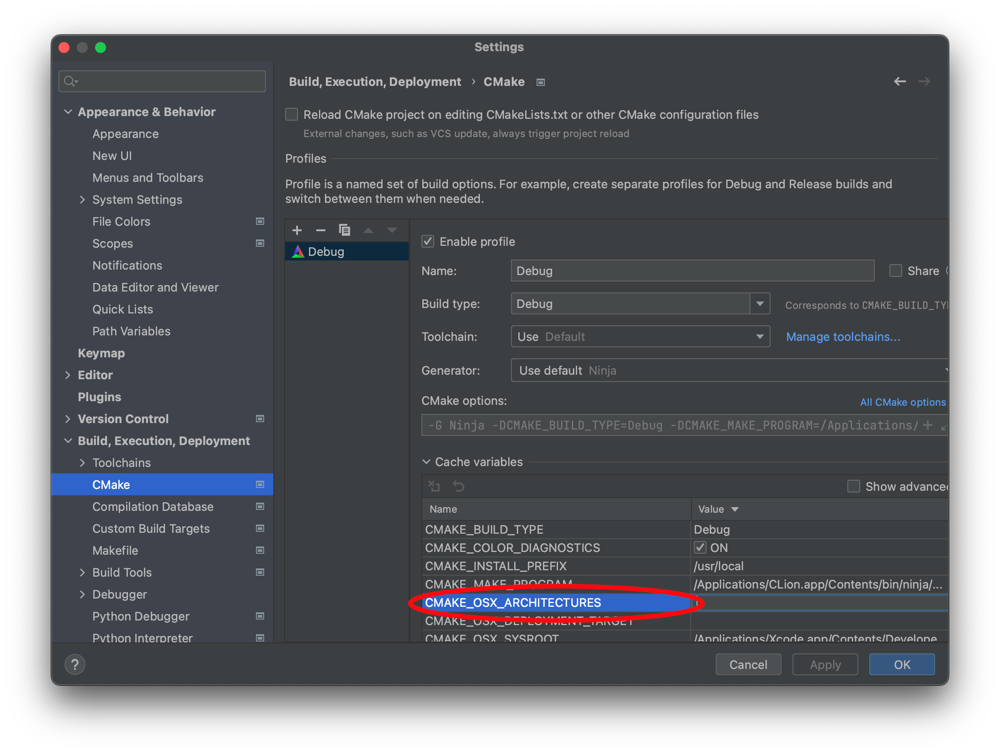
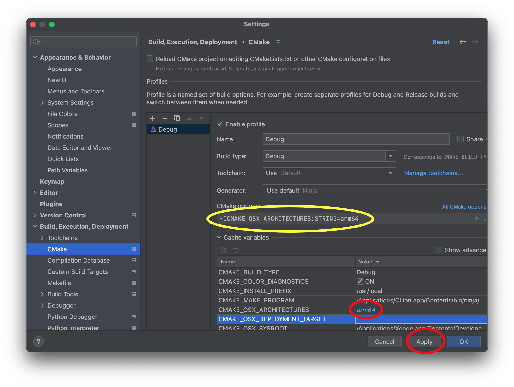

For this course, we will be using [CMake](https://cmake.org) to configure our build environment for proper compilation across different platforms. We will add each lab/assignment/exam as a subdirectory into a single project to allow all of the projects to be visible in the same IDE window.

## Marmoset Plugin

We will be using Marmoset for assignment and exam code submission. To get the Marmoset plugin for CLion, at the welcome screen select **Plugins**

> 

In the search bar, search for *marmoset* and click **Install** for the plugin.

> 

## Getting Started

Download [CS370\_Fa26.zip](CS370_Fa26.zip), saving it into the directory where you plan on placing all your CS370 projects.

Double-click on **CS370\_Fa26.zip** and extract the contents of the archive into a subdirectory called **CS370\_Fa26**

Open CLion, select **Open** from the main screen (you may need to close any open projects), and navigate to the **CS370\_Fa26** directory. This should open the project and execute the CMake script to configure the toolchain.

## Windows

In the popup dialog, in the **Toolchain** drop down select Visual Studio

> 

Then select **Manage toolchains**

> 

In the toolchain dialog, be sure Visual Studio is selected, then in the **Architecture:** dropdown, choose **amd64**

> 

Then click **OK** to exit the dialog boxes. This will set Visual Studio x64 as the compiler for all the projects we'll be importing into this project folder for this course.

## Mac OSX

In the popup dialog, in the **Toolchain** drop down simply leave the default for Mac OSX which will use the XCode Clang compiler for all the projects we'll be importing into this project folder.

> 

Then click **OK** to exit the dialog boxes. CLion will simply use the built-in OSX Terminal application.

Next, in the upper-right corner, select the gear icon and **Settings** from the menubar.

> 

In the **Settings** dialog, select the **Build, Execution, Deployment->CMake** option, and expand the **Cache variables** section.

> 

Find the **CMAKE_OSX_ARCHITECTURE** variable name (which should have a blank value)

> 

Set the **CMAKE_OSX_ARCHITECTURE** variable to **arm64**, select the next box down which should add a CMake option flag **-DCMAKE_OSX_ARCHITECTURES:STRING=arm64**. Click **Apply** and **OK** to close the dialog box.

> 
