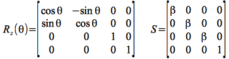
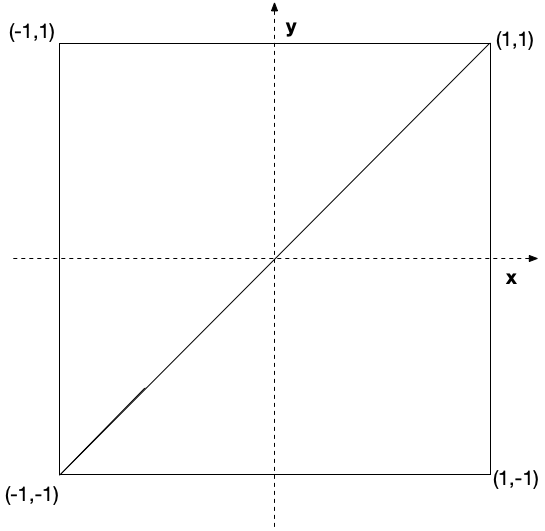
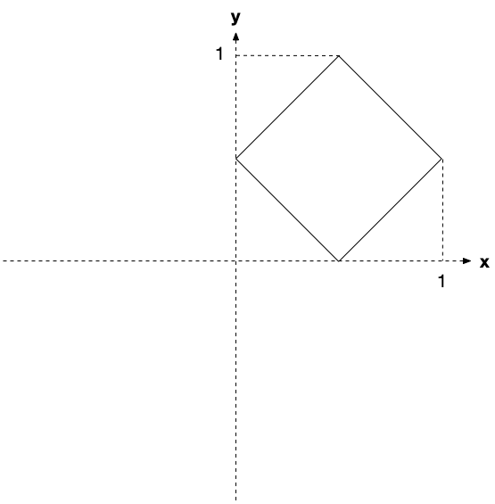
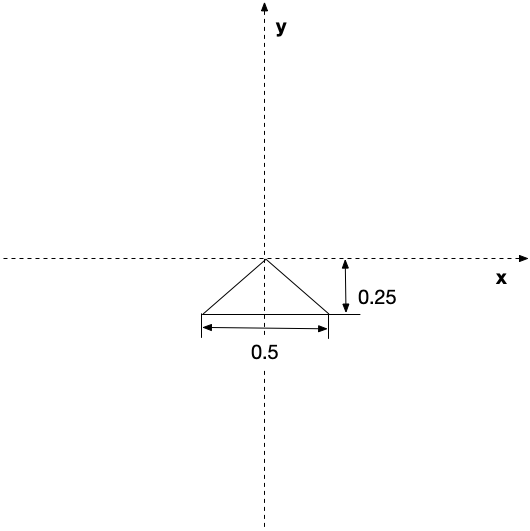
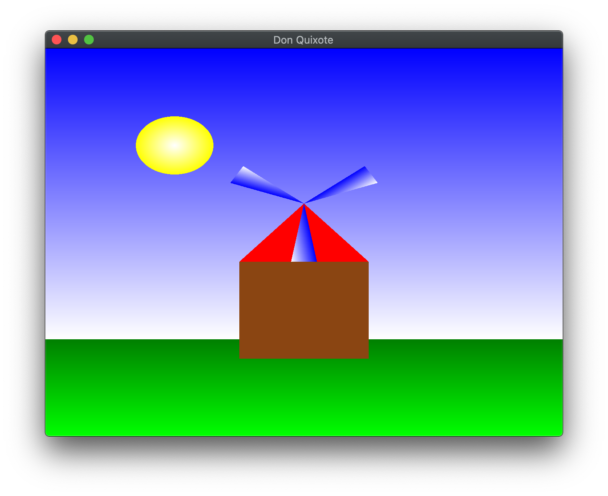

**Written Questions Due Tues, Sept 16th by 2:00 PM** (in class) Submit a **graded** pdf to Canvas by **Thursday, Sept 18th**.

**Program Due: Wednesday, Sept 17th by 11:59 PM** Late assignments will be penalized 20 points per day.

## Written Questions

1.  What are the main advantages and main disadvantages to generating images using the graphics pipeline?
2.  Show that a rotation and a *uniform* scaling transformations (i.e. one where all the scale factors are identical) are commutative, i.e. that they can be applied in either order. 

	> Hint: Given the *general* 4x4 matrices for each transformation
	>
    > 
	>
	> show that the appropriate matrix products commute, i.e. give the same result for *both* orderings.
	
3. Given the following set of vertices that define a square

> 

-   Sketch a set of *intermediate* transformations to produce the following end result with proper size, orientation, and location. Give the final product of your particular transformation sequence using **T(dx,dy)** for a translation by *dx* and *dy*, **R(θ)** for a rotation (about the *z* axis) by angle θ, and **S(sx,sy)** for a scaling by *sx* and *sy*.

> 

-   Sketch a set of *intermediate* transformations using only the *upper left* triangle vertices to produce the following end result with proper size, orientation, and location. Give the final product of your particular transformation sequence using **T(dx,dy)** for a translation by *dx* and *dy*, **R(θ)** for a rotation (about the *z* axis) by angle θ, and **S(sx,sy)** for a scaling by *sx* and *sy*.

> 
	
## Programming assignment

### Getting Started

Download [CS370\_Assign01\_Fa26.zip](src/CS370_Assign01_Fa26.zip), saving it into the **CS370\_Fa26** directory.

Double-click on **CS370\_Assign01\_Fa26.zip** and extract the contents of the archive into a subdirectory called **CS370\_Assign01\_Fa26**

Open CLion, select **CS370\_Fa26** from the main screen (you may need to close any open projects), and open the **CMakeLists.txt** file in this directory (**not** the one in the **CS370\_Assign01\_Fa26** subdirectory). Uncomment the line

```cpp
	add_subdirectory("CS370_Assign01_Fa26" "CS370_Assign01_Fa26/bin")
```

Finally, select **Reload changes** which should build the project and add **DonQuixote** to the dropdown menu at the top of the IDE window.

### Your Tasks

Write a program that draws a simple 2D "windmill" scene using OpenGL. A sample executable is included in the **demo** directory as either **DonQuixoteSolWin** or **DonQuixoteSolMac**. The scene should include:

-   A shaded blue sky from top to bottom
-   A shaded green lawn from bottom to top
-   A windmill with brown walls and red roof
-   A fan with three blades
-   A shaded yellow sun from center to edge
-   \<space\> should start/stop the windmill fan spinning using *time based* animation
-   left mouse button should reverse the fan direction
-   \<esc\> should quit the program

**Note:** For Mac's running Sequoia or later, you may need to follow these [instructions](https://discussions.apple.com/thread/255759797?sortBy=rank) to be able to run the demo.

*Hints:*

> OpenGL renders scenes using a *Painter's Algorithm* (at least for now). In this type of algorithm, the object that is rendered *last* will appear on *top*. This can be useful for making complicated shapes by simply overlapping simple shapes rather than using a single polygon with many vertices.
>
> All the *square* and *triangle* shapes should be generated with the **provided** sets of vertices. Use indexing to create the geometry from the vertices.
>
> Define separate color buffers for the different colors needed for each shape, e.g. gradient blue for the sky, gradient green for the grass, solid brown for the house. Solid color buffers can be created using **build\_solid\_color\_buffer()** separately in **build\_geometry()**. Gradient colors will need to have the colors (per vertex) defined in **build\_square()** or **build\_triangle()** functions and then call **build\_gradient\_color\_buffer()** to create the buffers. Consider which colors should be assigned to which vertices to achieve the desired effect.
>
> Use **transformations** to create all the geometry from the *square* (*triangle*) objects. It may be helpful to sketch the scene on a sheet of graph paper to determine proper scale factors, rotation angles, and translation offsets. **Note:** Scalings and rotations are defined relative to the world coordinate *origin* **not** the object *center*.
>
> For the sun, **GL\_TRIANGLE** is *not* the only type of object that can be rendered in OpenGL. Chap 3 of *OpenGL: Programming Guide* discusses several other primitive types that can be used to render a set of vertices, e.g. **GL\_TRIANGLE\_FAN**. Consider how to create the vertex buffer (without indices) with corresponding colors which can then be rendered using the provided **draw\_color\_fan\_object()** function.
>
> Use *global variables* (e.g. in **Globals.h**) to avoid *magic numbers* in the code, particularly for object transformations.
>
> Don't forget to *register* your callbacks, otherwise user interaction will have no effect.

## Grading Criteria

**The program MUST compile to receive any credit** (so develop incrementally). **Be sure to comment all creativity at the top of the source file.**

-   Create square object - 5 points
-   Create triangle object - 5 points
-   Create square color buffers - 7 points
-   Create triangle color buffers - 3 points
-   Draw shaded sky: 15 points
-   Draw shaded grass: 10 points
-   Draw solid house: 10 points
-   Draw fan: 15 points
-   Draw shaded sun: 10 points
-   Animation (keyboard, idle callbacks): 10 points
-   Creativity: 10 points

*Be creative!* For example, have the \<space\> act like a "puff" of air that starts the fan spinning but then gradually slows down until another \<space\> is pressed. Another option would be to add a keypress that changes the scene from day to night with the sun changing to a moon.

## Compiling and running the program

You should be able to build and run the program by selecting **DonQuixote** in the dropdown box in the toolbar and clicking the small green arrow next to it.

> 

To quit the program simply close the window.

## Submitting to Marmoset

When you are done, submit the assignment to the Marmoset server using the Terminal window in CLion (click **Terminal** at the bottom left of the IDE). Navigate to the directory using

<pre>
% <b>cd CS370_Assign01_Fa26</b>
CS370_Fa26/CS370_Assign01_Fa26 % <b>make submit</b>
</pre>

Enter your [Marmoset](https://cs.ycp.edu/marmoset) username and password, if successful you should see

<pre>
######################################################################
              >>>>>>>> Successful submission! <<<<<<<<<

Make sure that you log into the marmoset server to manually
check that the files you submitted are correct.

Details:

         Semester:   Fall 2026
         Course:     CS 370
         Assignment: assign01

######################################################################
</pre>

**You are responsible for making sure that your submission contains the correct file(s).**

