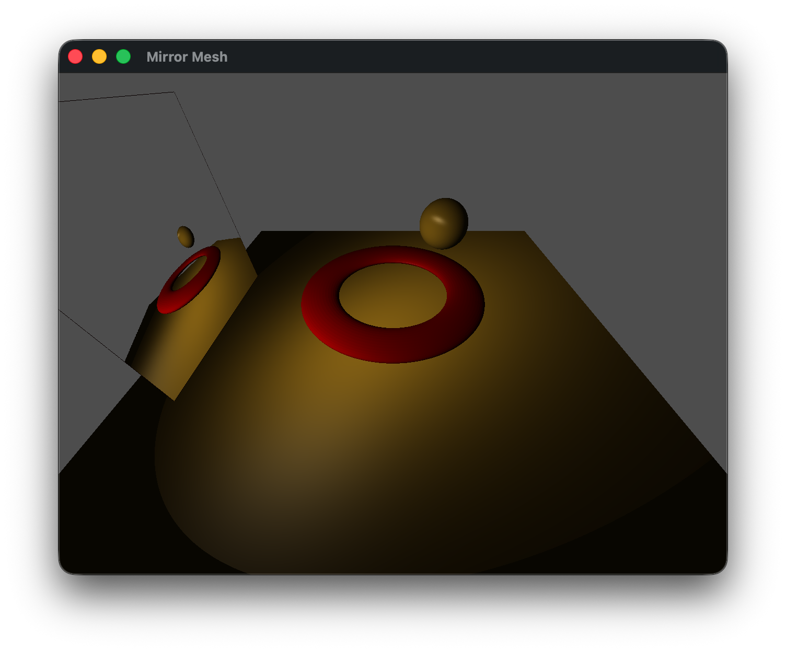
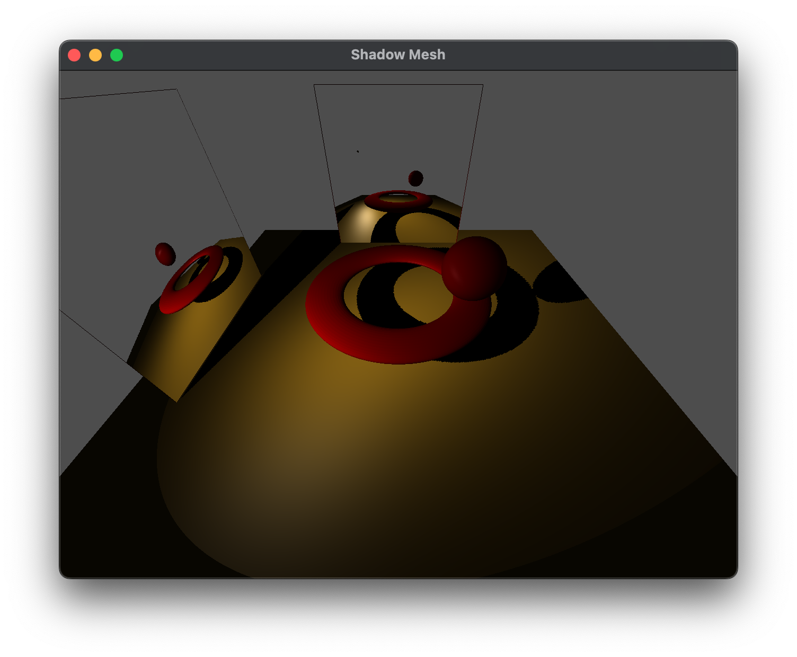

Often times we wish to have *reflective* surfaces, i.e. mirrors, within a scene. Unfortunately, similar to shadow mapping, one of the major shortcomings of the graphics pipeline is the lack of global information which would be needed for reflections (the reflective surface would need to know about the other objects in the scene). Again, we can address this issue (with a performance impact) using *multipass rendering*. To create a mirror, we will generate a texture map (known as an *environment map*) of the scene *rendered from the point of view of the reflective object*, which is then placed on the object within the scene thereby giving the appearance of reflection.

## Getting Started

Download [CS370\_Lab16.zip](src/CS370_Lab16.zip), saving it into the **CS370\_Fa25** directory.

Double-click on **CS370\_Lab16.zip** and extract the contents of the archive into a subdirectory called **CS370\_Lab16**

Open CLion, select **CS370\_Fa26** from the main screen (you may need to close any open projects), and open the **CMakeLists.txt** file in this directory (**not** the one in the **CS370\_Lab16** subdirectory). Uncomment the line

```cpp
	add_subdirectory("CS370_Lab16" "CS370_Lab16/bin")
```

Finally, select **Reload changes** which should build the project and add it to the dropdown menu at the top of the IDE window.

#### Solution

Download [CS370\_Lab16\_Solution.zip](sol/CS370_Lab16_Solution.zip), saving it into the **CS370\_Fa26** directory.

Double-click on **CS370\_Lab16\_Solution.zip** and extract the contents of the archive into a subdirectory called **CS370\_Lab16\_Solution**

Open CLion, select **CS370\_Fa26** from the main screen (you may need to close any open projects), and open the **CMakeLists.txt** file in this directory (**not** the one in the **CS370\_Lab16\_Solution** subdirectory). Uncomment the line

```cpp
	add_subdirectory("CS370_Lab16_Solution" "CS370_Lab16_Solution/bin")
```

Finally, select **Reload changes** which should build the project and add it to the dropdown menu at the top of the IDE window.

## Pass 1 - Texture Mapping the Framebuffer

### Environment map texture

In order to store the image of the scene from the perspective of the mirror, we will create a texture (similar to the shadow map) which is the same size as the framebuffer to avoid the need to perform any scaling. Furthermore, typically we will not enable mipmapping for the environment map and simply copy the framebuffer into level 0 of the environment map texture (of equivalent size). 

### Tasks

- Add code in **mirror.cpp** to **build\_mirror\_tex()** to creates an empty mirror texture for the environment map (which is allocated and bound for the *m\_texid* parameter that is passed as *MirrorTex*) that is *ww* by *hh* using **glTexImage2D()**

```cpp
    glTexImage2D(GL_TEXTURE_2D, 0, GL_RGBA, ww, hh, 0, GL_RGBA, GL_FLOAT, NULL);
```

**Note:** When creating this texture, we did not build mipmaps as we will be loading the texture map dynamically each time we render the scene (thus it would be computationally expensive to continually regenerate mipmaps).

### Setting the mirror perspective

We will create the effect of reflection by rendering the scene from the *point of view of the reflective object* and copy that image into the environment map. Therefore, the first thing we must do in the **render\_mirror\_tex( )** function is set an appropriate projection matrix using either **ortho( )** or **frustum( )**. The key here is to select extents that are representative of the reflective surface, i.e. usually with the near clipping plane at (or very near for a frustum) 0.0 which will be the object's surface, the far clipping plane set to capture the objects of interest, and the other extents to match the geometry of the object itself. Next we need to position the camera at the *center of the object* and point it *away from* the reflective surface. Depending on the desired effect, this direction can be either perpendicular to the surface or (more realistically) at an equal angle from the viewer (recall angle of incidence equals angle of reflection), see [How to calculate the reflection vector](https://www.fabrizioduroni.it/2017/08/25/how-to-calculate-reflection-vector/) for the math to compute this. Once the projection matrix and camera position are set appropriately, we simply render the scene *without* the reflective surface. This will create the "picture" of the scene from the point of view of the reflective surface in the framebuffer. However instead of using **glfwSwapBuffers( )** to display it on the screen, we will place the image *into a texture* using

```cpp
glCopyTexImage2D(GL_TEXTURE_2D, level, format, x, y, w, h, border);
```

where *level* indicates the mipmap level to store the image into (which we will use level 0 for the environment map), *format* is the format to store the image in (usually **GL\_RGBA**), *x* and *y* are the initial lower-left *raster coordinates* of the framebuffer, *w* and *h* are the width and height of the image to capture, and *border* specifies a border width for the image.

**Note:** **glCopyTexImage2D( )** copies the framebuffer into the *currently selected* texture map, so be careful to avoid overwritting a pre-existing object texture.

Also since the environment takes the image from the framebuffer, any effects used in rendering the scene, e.g. lighting and texture mapping, will appear in the reflection.

### Tasks

- Add code in **mirror.cpp** to **render\_mirror\_tex( )** to set the *proj\_matrix* to a **frustum** with extents (-0.2,0.2,-0.2,0.2,0.2,100.0).

- Add code in **mirror.cpp** to **render\_mirror\_tex( )** to set the *camera\_matrix* for the mirror camera position using **lookat** with *mirror_eye*, *mirror_center*, *mirror_up* as the vectors. **Note:** we will use *mirror_eye* as the translation transformation when we render the mirror.

- Add code in **mirror.cpp** to **render\_mirror\_tex( )** after the scene has been rendered to activate **GL_TEXTURE0** using **glActiveTexture()**.

- Add code in **mirror.cpp** to **render\_mirror\_tex( )** to bind the *m\_texid* element of the *TextureIDs[]* array which will be the texture where the environment map is stored (i.e. the one created in the previous section).

- Add code in **mirror.cpp** to **render\_mirror\_tex( )** to copy the framebuffer to the bound environment map using **glCopyTexImage2D()** into level 0, using **GL_RGBA** format, starting at (0,0), of size (ww,hh), and with 0 border.

- Add code to **main()** in the rendering loop to call **render\_mirror\_tex()** *before* rendering the actual scene with **display()**. Pass the *MirrorTex* index of the *TextureIDs[]* array which is the reference to the environment map.

**Note:** To help with mirror positioning and extents, uncomment the **renderQuad()** function and comment out **display()** to render the environment map to the screen until it appears the way you would like.

## Rendering the Scene with Mirror

Once the map is created, we simply render the scene as usual (using **render\_scene()**) and add the mirror as a texture mapped object that uses the environment map texture.

### Tasks

- Add code in **render.cpp** to **render\_scene()** to compute *trans\_matrix* as a translation by *mirror\_eye*, i.e. place the mirror at the same spot that the mirror camera was located to generate the environment map. **Hint:** You can use the vector version of **translate()** rather than separate out the individual components.

- Add code in **render.cpp** to **render\_scene()** to compute *rot\_matrix* as a rotation by -90 degrees about the x-axis (so that the mirror is vertical in the scene).

- Add code in **render.cpp** to **render\_scene()** to compute *scale\_matrix* as a scaling by 2.0 along each axis.

- Add code in **render.cpp** to **render\_scene()** to compute *model\_matrix* as the product of the translation, rotation, and scaling matrices.

- Add code in **render.cpp** to **render\_scene()** to draw the mirror using **drawTextureObject()** with the *plane* object and the *MirrorTex* index of the *TextureIDs[]* array.

**Note:** No new shader code was required as it simply is rendering the scene normally from two different perspectives.

## Compiling and running the program

You should be able to build and run the program by selecting **mirrorMesh** from the dropdown menu and clicking the small green arrow towards the right of the top toolbar.

At this point you should see a torus and revolving sphere that are reflected in a mirror

> 

To quit the program simply close the window.

Congratulations, you have now written an application incorporating mirrors.

Next we will investigate how to apply multiple textures to an object.

### Combining Shadows with Mirrors

We can also incorporate shadows into the scene by first rendering the scene from the point of view of the light (storing the depth field in a texture) *excluding* the mirror, then render the scene from the point of view of the mirror adding in the shadows (storing the framebuffer in a texture) again *excluding* the mirror, and then finally rendering the scene *with* the mirrors. Multiple mirrors can be added in a similar fashion with the constraint that it is difficult to have the mirrors reflect each other. Here is a sample solution with two mirrors and shadows

[CS370\_Lab16\_Shadow\_Solution.zip](sol/CS370_Lab16_Shadow_Solution.zip)

You will need to uncomment the following line in your **CMakeLists.txt** file in the **CS370\_Fa25** directory (**not** the one in the **CS370\_Lab16\_Shadow\_Solution** subdirectory).

```cpp
	add_subdirectory("CS370_Lab16_Shadow_Solution" "CS370_Lab16_Shadow_Solution/bin")
```

> 
