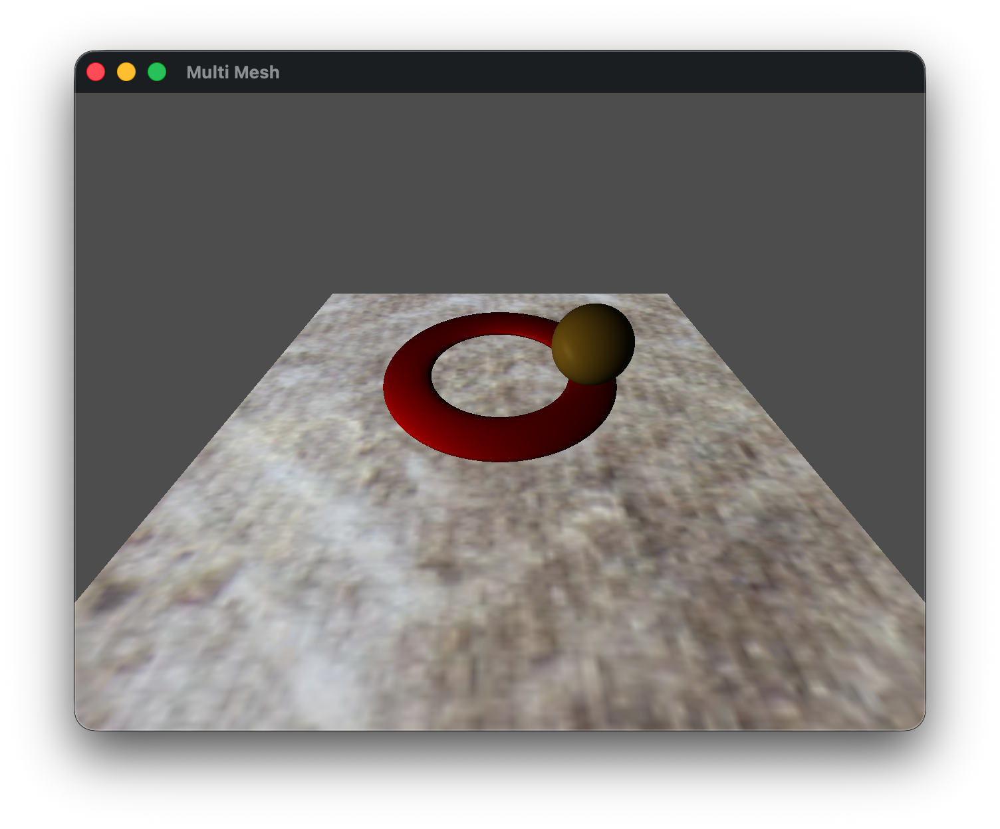
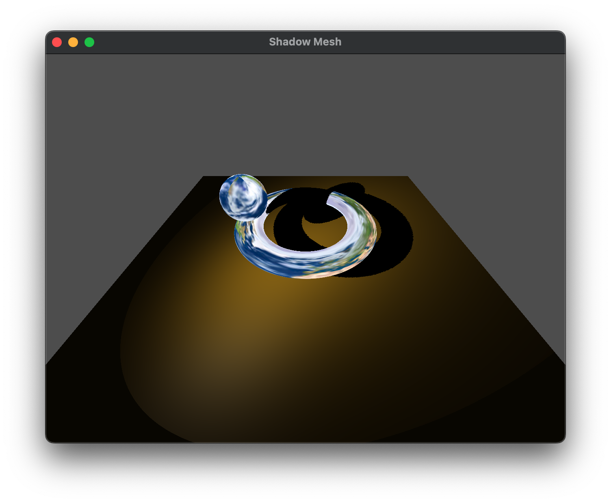

While texture mapping is a nice way of simulating surface textures without additional geometry, we can further embellish the appearance by blending *multiple textures* together on the same surface using *multi-texturing*. In this lab we will see how to use multiple texture *units* to sample multiple textures in the fragment shader. 

## Getting Started

Download [CS370\_Lab17.zip](src/CS370_Lab17.zip), saving it into the **CS370\_Fa26** directory.

Double-click on **CS370\_Lab17.zip** and extract the contents of the archive into a subdirectory called **CS370\_Lab17**

Open CLion, select **CS370\_Fa26** from the main screen (you may need to close any open projects), and open the **CMakeLists.txt** file in this directory (**not** the one in the **CS370\_Lab17** subdirectory). Uncomment the line

```cpp
	add_subdirectory("CS370_Lab17" "CS370_Lab17/bin")
```

Finally, select **Reload changes** which should build the project and add it to the dropdown menu at the top of the IDE window.

#### Solution

Download [CS370\_Lab17\_Solution.zip](sol/CS370_Lab17_Solution.zip), saving it into the **CS370\_Fa26** directory.

Double-click on **CS370\_Lab17\_Solution.zip** and extract the contents of the archive into a subdirectory called **CS370\_Lab17\_Solution**

Open CLion, select **CS370\_Fa26** from the main screen (you may need to close any open projects), and open the **CMakeLists.txt** file in this directory (**not** the one in the **CS370\_Lab17\_Solution** subdirectory). Uncomment the line

```cpp
	add_subdirectory("CS370_Lab17_Solution" "CS370_Lab17_Solution/bin")
```

Finally, select **Reload changes** which should build the project and add it to the dropdown menu at the top of the IDE window.

## Texture Map references

Since we are using several textures, we will need to have several sampler shader variables. We do by declaring multiple **uniform sampler2D** variables in the *fragment shader*. Then we will associate these sampler variables with a application reference identifiers using

```cpp
GLint glGetUniformLocation(GLuint program, const GLchar *name);
```

where *program* is the shader program and *\*name* is a string with the name of the shader sampler variable.

### Tasks

- If you look in the **ShaderUtils.cpp** file at the **buildMultiTextureShader()** function, you'll see a reference assignment for the **blendMap** shader variable which will be the sampler for the second (dirt) texture.

### Multiple Texture Units

In order to use multiple textures, we will need to utilize multiple *texture units* by defining which texture unit to associate with which shader sampler, and then *bind* the textures we wish to use to each unit. OpenGL supports a minimum of 16 texture units per pipeline stage which are referred to using the constants **GL_TEXTURE\#** where \# is the number of the texture unit, e.g. **GL_TEXTURE0**. Thus we will specify which texture unit to associate with a shader sampler using

```cpp
void glUniform1i(GLint location, GLint value);
```

where *location* is the reference for the shader sampler and *value* is the unit number we wish to associate with the sampler. Then we will make the texture unit *active* using 

```cpp
void glActiveTexture(GLenum tex_unit);
```

where *tex\_unit* is a symbolic constant of the form **GL\_TEXTURE***i* where *i* is the number of the texture unit we wish to make active, e.g. **GL\_TEXTURE0**.

Finally, we will bind the desired texture to the unit as usual using

```cpp
void glBindTexture(GLenum target, GLuint texture);
```

where *target* is a symbolic constant denoting the *type* of texture we are binding (e.g. for image data **GL\_TEXTURE\_2D**) and *texture* is the texture id for the texture we are binding to the currently active texture unit.

### Tasks

- Add code in **draw.cpp** to **drawMultiTextureObject()** to set the *multi\_tex\_base\_loc* to 0, i.e. we will bind the base texture to texture unit 0, using **glUniform1i()** (since this is an integer value).

- Add code in **draw.cpp** to **drawMultiTextureObject()** to make texture unit 0 active using **glActiveTexture()** with **GL_TEXTURE0**.

- Add code in **draw.cpp** to **drawMultiTextureObject()** to bind the *texID1* texture id parameter to the active texture unit (texture unit 0).

- Add code in **draw.cpp** to **drawMultiTextureObject()** to set the *multi\_tex\_blend\_loc* to 1, i.e. we will bind the dirt texture to texture unit 1, using **glUniform1i()** (since this is an integer value).

- Add code in **draw.cpp** to **drawMultiTextureObject()** to make texture unit 1 active using **glActiveTexture()** with **GL_TEXTURE1**.

- Add code in **draw.cpp** to **drawMultiTextureObject()** to bind the *texID2* texture id parameter to the active texture unit (texture unit 1).

- Add code in **render.cpp** to **render\_scene()** to call **drawMultiTextureObject()** with the *cube* (object), the *Carpet* index from the *TextureIDs[]* array (base texture), and *multiTexID* index from the *TextureIDs[]* array (blank or dirt texture set with the *dirty* flag), and the *mix* variable controlling how much of each texture is used. This will render the carpet blended either with just a blank texture or with a combination of the dirt texture.

**Note:** Since our shader will be combining colors from both textures, it is important that they each be associated with a texture unit containing an appropriate texture.

## Multiple Texture Coordinates

For this lab we will simply be using the same texture coordinates for both texture maps. However, if the model/loader supported multiple texture coordinates, we could store them in separate texture coordinate buffers and pass them through the vertex shader to the fragment shader.

## Combining Texture Colors

The last step to applying multiple textures is sampling both textures in the fragment shader and deciding how to *combine* the two colors together for the final fragment color. 

Several options can include simple addition of the two colors, simple multiplication of the two colors, using the **mix()** function to perform a linear interpolation (using an application variable), or some other combination of the two.

### Tasks

- Add code in **draw.cpp** to **drawMultiTextureObject()*** to set the *multi\_tex\_mix\_loc* to *mix* using **glUniform1f()** (since this is a floating point value).

- Add code to **multiTex.frag** to sample *blendMap* at *texCoord* and store the result in *blendColor*

```cpp
    vec4 blendColor = texture(blendMap, texCoord);
```

- Add code to **multiTex.frag** to mix the two texture colors using **mix()** with the *mixFactor*

```cpp
    fragColor = mix(baseColor,blendColor,mixFactor);
```

**Note:** Try other ways of combining the two texture colors to see what effect it produces.

## Compiling and running the program

You should be able to build and run the program by selecting **multiTexMesh** from the dropdown menu and clicking the small green arrow towards the right of the top toolbar.

At this point you should see a torus and revolving sphere over a carpet that is mixed with either a blank or "dirt" texture (toggled using enter). Arrow up/down will control the amount of the second texture that is mixed.

> 

To quit the program simply close the window.

Congratulations, you have now written an application incorporating multiple textures.

Next we will investigate how to apply multiple textures to accomplish bump mapping.

### Shadows with Textures

With multitexturing, it is possible to combining shadow mapping with textures (since the shadow map is stored in a texture). Here is a sample solution

[CS370\_Lab17\_ShadowTexture\_Solution.zip](sol/CS370_Lab17_ShadowTexture_Solution.zip)

You will need to uncomment the following line in your **CMakeLists.txt** file in the **CS370\_Fa26** directory (**not** the one in the **CS370\_Lab17\_ShadowTexture\_Solution** subdirectory).

```cpp
	add_subdirectory("CS370_Lab17_ShadowTexture_Solution" "CS370_Lab17_ShadowTexture_Solution/bin")
```

> 

